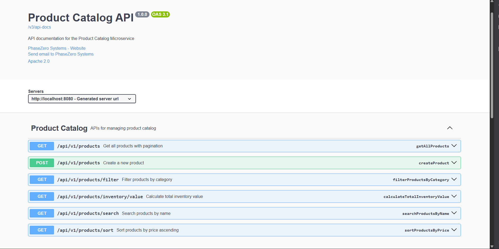
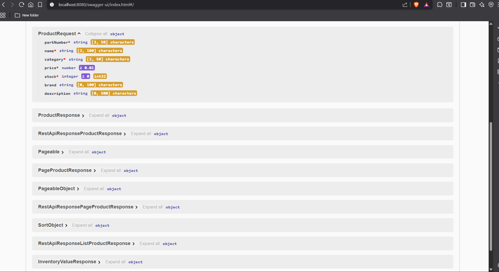

# 📦 PhaseZero Catalog Service API

A clean and modular Spring Boot application for managing a Product Catalog.  
Supports product creation, listing, search, filtering, sorting, and inventory value calculation.  
Built for the **PhaseZero Backend Java Assignment**.

---
```
──────────────────────────────────────────────────────────────
🌍 BASE URLS
──────────────────────────────────────────────────────────────
Application     : http://localhost:8080
Swagger UI      : http://localhost:8080/swagger-ui.html
OpenAPI JSON    : http://localhost:8080/v3/api-docs
H2 Console      : http://localhost:8080/h2-console
```
---
──────────────────────────────────────────────────────────────
### 🚀 TECH STACK
──────────────────────────────────────────────────────────────
```
• Java 17
• Spring Boot 3.x
• Spring Web
• Spring Data JPA
• H2 In-Memory Database
• Jakarta Validation
• Swagger (OpenAPI 3)
• Maven
• Lombok
• SLF4J Logging
```
---
──────────────────────────────────────────────────────────────
### 🏗️ PROJECT STRUCTURE
──────────────────────────────────────────────────────────────
```
src/main/java/com/phasezero/catalog
│
├── controller        → REST API layer
├── service           → Business logic
│   └── impl          → Service implementations
├── repository        → JPA repositories
├── entity            → JPA models
├── requestdto        → Input DTOs
├── responsedto       → Output DTOs
├── exception         → Custom exceptions
└── config            → Swagger + app configuration
```
---
──────────────────────────────────────────────────────────────
### 🔄 ARCHITECTURE FLOW
──────────────────────────────────────────────────────────────
```
Client
│
▼
Controller  → Validates input & handles requests
│
▼
Service     → Business rules & processing
│
▼
Repository  → Database operations
│
▼
H2 Database
```
---
──────────────────────────────────────────────────────────────
### ✨ FEATURES
──────────────────────────────────────────────────────────────
```
✔ Create new product
✔ Get all products (with pagination)
✔ Search products by name (case-insensitive)
✔ Filter by category
✔ Sort by price (ascending)
✔ Calculate total inventory value
✔ Custom exception handling
✔ Swagger UI documentation
```
──────────────────────────────────────────────────────────────
### 🧩 PRODUCT DATA MODEL
──────────────────────────────────────────────────────────────
```
id           : Long
partNumber   : String   (unique)
name         : String
category     : String
price        : BigDecimal
stock        : Integer
createdAt    : LocalDateTime
updatedAt    : LocalDateTime
```
----
──────────────────────────────────────────────────────────────
### 🌐 API ENDPOINTS
──────────────────────────────────────────────────────────────
```
POST   /api/v1/products                 → Create product
GET    /api/v1/products                 → List products (paginated)
GET    /api/v1/products/search          → Search by name
GET    /api/v1/products/filter          → Filter by category
GET    /api/v1/products/sort            → Sort by price ASC
GET    /api/v1/products/inventory/value → Total inventory value
```
---
──────────────────────────────────────────────────────────────
### 📝 SAMPLE REQUESTS & RESPONSES
──────────────────────────────────────────────────────────────
```
1) CREATE PRODUCT
   ──────────────────────────────────────
   REQUEST:
   {
   "partNumber": "P-1203",
   "name": "Air Filter",
   "category": "Filters",
   "price": 350.00,
   "stock": 15
   }

RESPONSE:
{
"status": "created",
"message": "Resource created successfully",
"data": {
"id": 1,
"partNumber": "P-1203",
"name": "Air Filter",
"category": "Filters"
},
"path": "/api/v1/products"
}

2) SEARCH PRODUCT
   ──────────────────────────────────────
   GET /api/v1/products/search?name=filter

RESPONSE:
{
"status": "success",
"message": "Products found",
"data": [
{
"id": 1,
"name": "Air Filter",
"partNumber": "P-1203"
}
],
"path": "/api/v1/products/search"
}
```
---
──────────────────────────────────────────────────────────────
### ⚖️ BUSINESS RULES
──────────────────────────────────────────────────────────────
```
• partNumber must be unique
• name, category, price, stock → required fields
• price ≥ 0
• stock ≥ 0
• Search is case-insensitive
• Pagination enabled for listing
```
──────────────────────────────────────────────────────────────
### 🛠️ RUNNING THE APPLICATION
──────────────────────────────────────────────────────────────
```
Build:
mvn clean install

Run:
mvn spring-boot:run
```
---
──────────────────────────────────────────────────────────────```
### 🗄️ H2 DATABASE CONFIG
──────────────────────────────────────────────────────────────
```
Console URL:
http://localhost:8080/h2-console

JDBC URL:
jdbc:h2:mem:catalogdb
```
---
──────────────────────────────────────────────────────────────
### 📘 SWAGGER DOCUMENTATION
──────────────────────────────────────────────────────────────
```
Open Swagger UI:
http://localhost:8080/swagger-ui.html
```
---


---